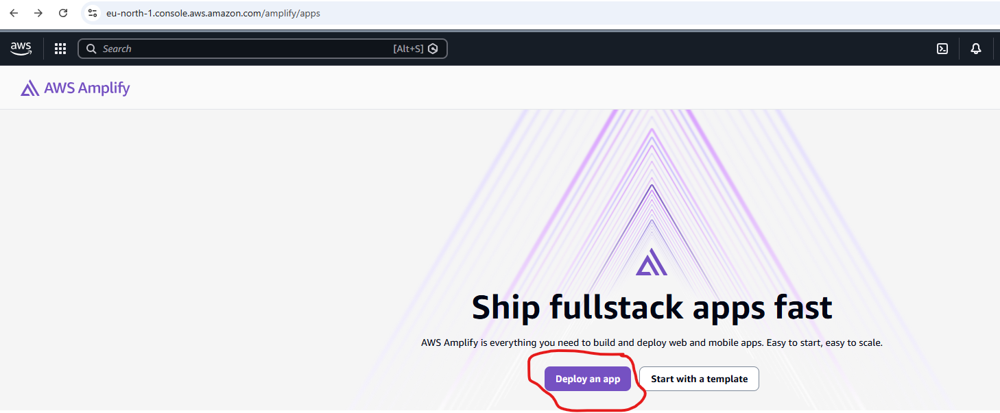
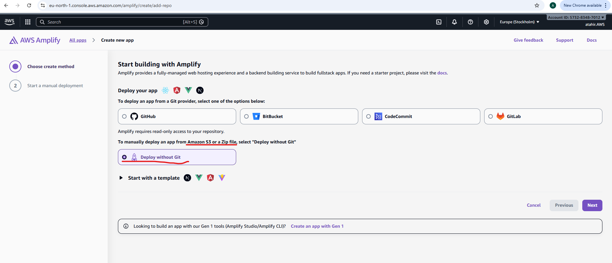
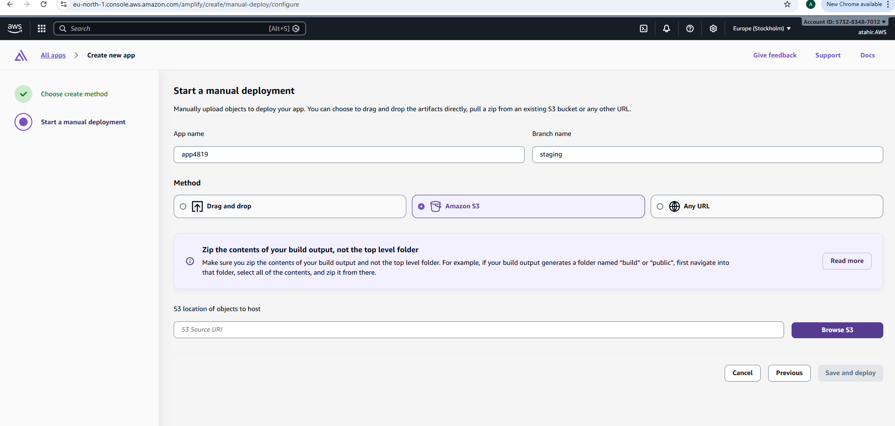
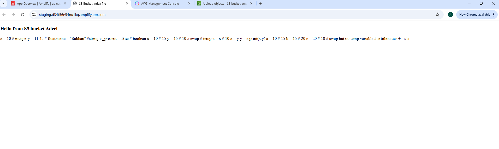

# AWS-Work
Hosting a static website with S3 and AWS Amplify 

step1: create an index.html file on github/local computer.

step2: crate a s3 bucket.

step3: upload index.html to newly crated s3 bucket.

step4: open aws amply server and add this s3 bucket to serve the index.html file as a static website.

step5: open aws amplify service, then click deploy. 

step6: deploying with s3 bucket: Not using git for now 

